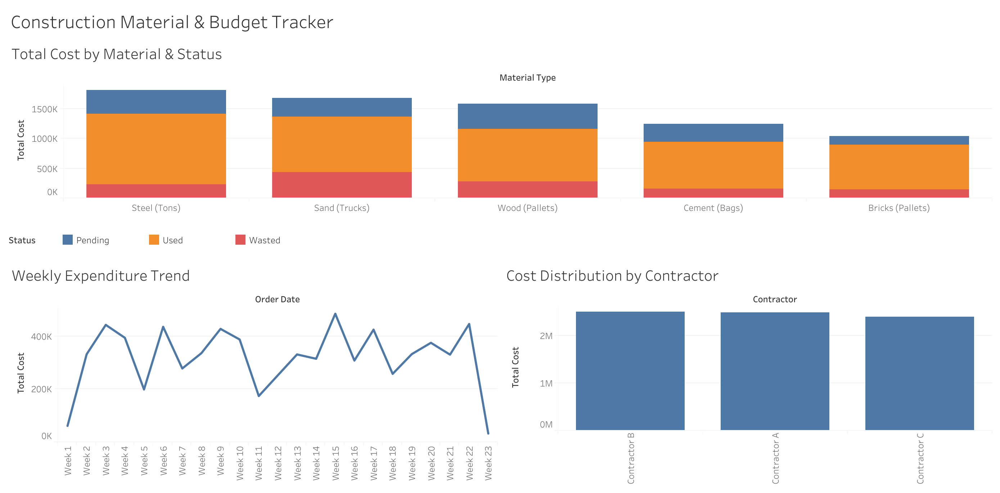

# Construction Material & Budget Tracker 

## Project Overview
This project demonstrates an automated End-to-End data pipeline designed to track construction material usage, optimize budget allocation, and reduce waste. 

## Workflow
1. **Data Engineering (Python & Pandas):** Engineered a script to generate and clean daily operational mock data for multiple contractors, simulating real-world supply chain tracking.
2. **Data Analysis & Visualization (Tableau):** Designed a dynamic dashboard to visualize weekly expenditure trends, cost distribution among contractors, and material waste metrics.

## Files Included
* `generate_data.py`: The Python script used for ETL and generating the dataset.
* `Construction_Materials_Log.csv`: The structured dataset containing 500 rows of material orders.
* `dashboard_preview.jpg`: A visual snapshot of the interactive Tableau dashboard.

## Dashboard Preview

